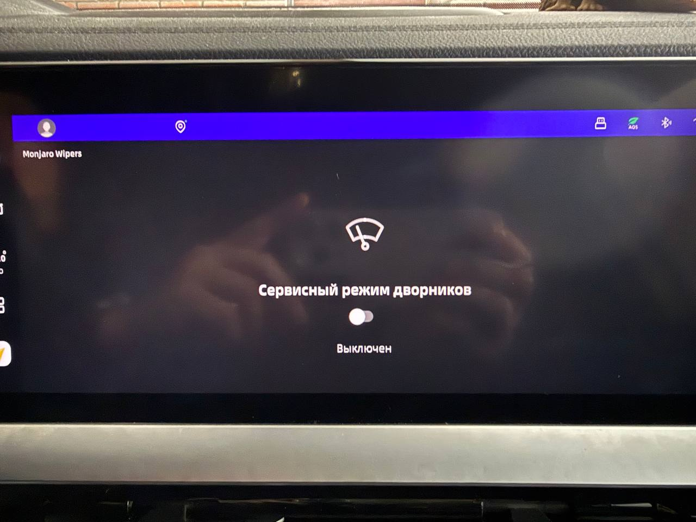
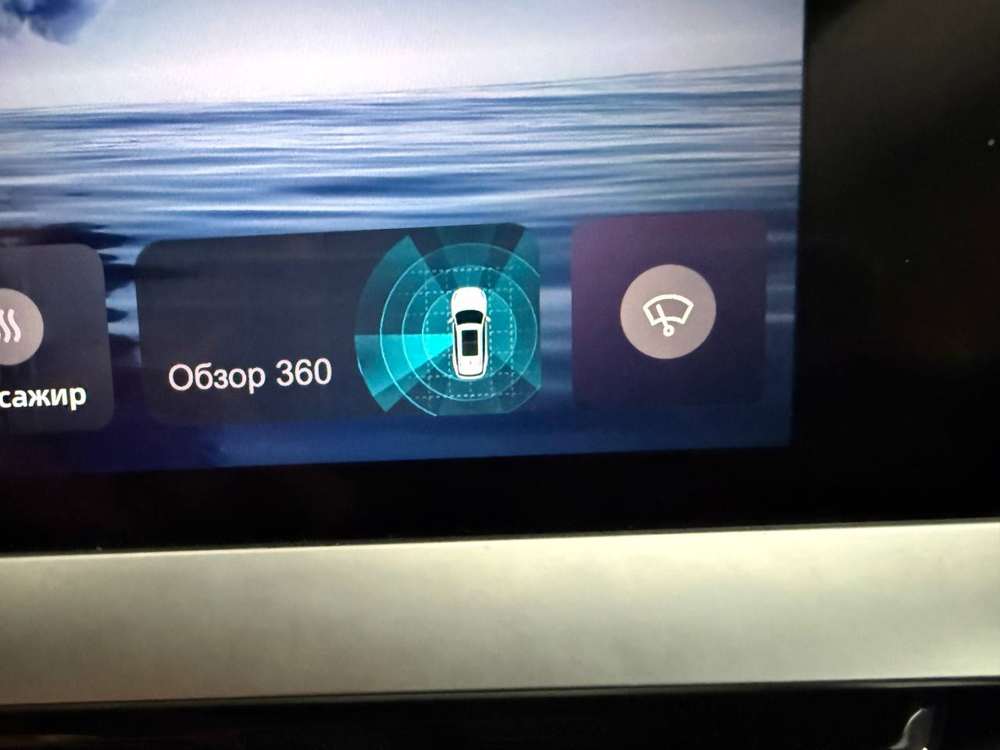

# Monjaro Wipers

<table><tr>
<td></td>
<td>

> [!WARNING]
> Приложение тестировалось **исключительно на рестайлинговой модели Geely Monjaro**.
> Работоспособность на дорестайлинговых версиях **не гарантируется**.

</td>
</tr></table>

**Monjaro Wipers** — приложение для **Geely Monjaro Рестайлинг**, которое позволяет переводить стеклоочистители в сервисное положение одним нажатием — через приложение или виджет на главном экране.

> [!NOTE]
> Виджеты поддерживаются начиная с **OS 2.0**. На более ранних версиях добавить виджет невозможно.

## Возможности
- перевод стеклоочистителей в сервисное положение
- возврат стеклоочистителей в рабочее положение

## Скриншоты

| Приложение | Виджет |
|:---:|:---:|
|  |  |

## Использование
1. Установите приложение в систему автомобиля.
2. Добавьте виджет **Monjaro Wipers** на главный экран через стандартное меню виджетов.
3. Нажмите на виджет, чтобы перевести стеклоочистители в сервисное положение или обратно.
